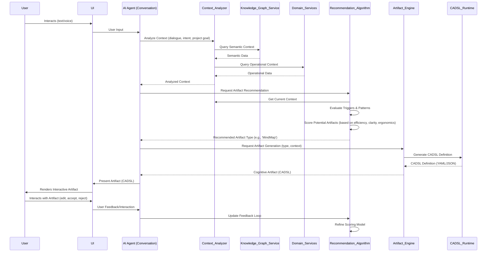

# **The Sentient Enterprise Architecture (SEA) - Version 5.0: Cognitive Amplification with Automated Documentation**

## **Deliverable 1: The Executive Synthesis**

This document presents **Version 5.0 of the Sentient Enterprise Architecture (SEA)**, an advanced conceptual framework that extends the foundational principles of business semantics, software engineering, AI capabilities, and formal architectural definition with a **Cognitive Extension Layer** and an **Automated Documentation Generation (ADG) Framework**. The Cognitive Extension Layer is designed to amplify human intelligence by providing real-time, context-aware support for knowledge work through the dynamic generation and recommendation of **Cognitive Artifacts**. The ADG Framework ensures that comprehensive, accurate, and semantically-aligned documentation is automatically generated and maintained, keeping knowledge current and accessible.

Building upon the robust core of a DSL enriched by SBVR and governed by CALM, SEA 5.0 integrates the principles of the **Knowledge, Attention, and Intention Economies** to create a truly synergistic system where AI acts as a cognitive partner, enhancing human thought processes, decision-making, and knowledge sharing. The ADG Framework treats documentation as a first-class cognitive artifact, leveraging the same semantic infrastructure and AI capabilities that power the Cognitive Extension Layer.

SEA 5.0 recognizes that effective knowledge work is a continuous process of transforming intellectual capital into intellectual artifacts and properties, including documentation. The Cognitive Extension Layer and ADG Framework work together to provide a comprehensive framework for AI to understand user needs and project context, dynamically construct symbolic cognitive artifacts and documentation from a MECE (Mutually Exclusive and Collectively Exhaustive) set of fundamental elements, and ensure that knowledge is always current, accurate, and accessible. This approach ensures that the AI's assistance is not merely reactive but proactively supportive, optimizing information encoding efficiency, thought representation clarity, documentation quality, and overall cognitive ergonomics.

The architecture maintains its commitment to the **Isomorphic Architecture** principle, ensuring that the semantic core (DSL/SBVR) and architectural blueprint (CALM) remain the single source of truth. The Cognitive Extension Layer and ADG Framework act as intelligent interfaces, translating the rich semantics of the SEA into actionable cognitive support and comprehensive documentation. This transforms the enterprise into a **Sentient Enterprise** that not only operates with complete consistency across its computational, knowledge, intelligence, architectural, and documentation layers but also actively augments the cognitive capabilities of its human workforce, fostering a continuous cycle of learning, adaptation, innovation, and knowledge sharing. This version provides comprehensive technical specifications, diagrams, and data schemas to enable developers to build out this advanced cognitive support and automated documentation system.


## **Deliverable 1.1: Conceptual Architecture**

The Sentient Enterprise Architecture (SEA) is structured around an **Isomorphic Stack**, ensuring that the formal definition of the business domain and its architectural blueprint are consistently reflected and operationalized across all layers of the enterprise. Version 4.0 introduces a **Cognitive Extension Layer** to this stack, designed to provide real-time, context-aware cognitive support to knowledge workers.

### **The Isomorphic Stack (Meta-Framework)**

1.  **Semantic Core (The DSL with SBVR Integration):** This foundational layer defines the enterprise in a formal, generative language, rigorously enforced by **SBVR (Semantics of Business Vocabulary and Business Rules)**. The DSL, leveraging the **MUDM (Multi-dimensional Universal Domain Model)**, captures `Entities`, `Resources`, `Flows`, `Instances`, and `Policies` in a machine-readable format. SBVR provides the formal framework for defining the **Ubiquitous Language** with precision, documenting business vocabulary, and formalizing business rules. This ensures that the core business logic is unambiguous, consistent, and directly translatable into executable artifacts [pasted_content_2.txt].

2.  **Architectural Layer (CALM):** This layer formally defines the system's architecture as code using **CALM (Common Architecture Language Model)**. CALM provides a JSON-based meta-schema for modeling components (nodes), their interactions (relationships), metadata, and controls. It ensures that architectural definitions live in source control, enabling versioning, automated validation against approved patterns, and on-demand visualization. CALM acts as a higher-level abstraction that complements and enhances existing infrastructure and application code by enforcing “architecture-as-code” [IncorporatingCALMintoYourArchitectureStack.pdf].

3.  **Computational Layer (The Domain Model):** This layer represents the executable projection of the DSL. It embodies the principles of **Domain-Driven Design (DDD)** and **Hexagonal Architecture**, focusing on decoupled, encapsulated, and agnostic components. The DSL, enriched by SBVR rules, drives the generation of domain services, aggregates, and value objects. AI-driven code generation, guided by EARS-formatted requirements and custom instructions, can scaffold a significant portion of this layer, including tests and initial domain structures [pasted_content_2.txt]. The CALM definition of the architecture provides the structural blueprint for this layer, ensuring that generated code adheres to defined architectural patterns.

4.  **Knowledge Layer (The Knowledge Graph):** This layer is the inferential projection of the DSL, manifested as a semantic network. It uses technologies like **RDF, OWL, and SHACL** to represent the business domain, its entities, relationships, and rules. The formalization provided by SBVR directly populates this graph, enabling advanced reasoning, validation, and semantic search capabilities. This layer serves as the factual grounding for AI agents, and its structure can be informed by the CALM architectural model to ensure consistency between the knowledge representation and the system's actual design.

5.  **Intelligence Layer (The Agentic Fabric):** This layer comprises AI agents that operate on and interact with the Computational and Knowledge Layers. These agents are grounded in the Knowledge Graph and their behaviors are configured through a **DSL for AI Prompt Management**. Drawing analogies from parameter-efficient fine-tuning techniques like **LoRA (Low-Rank Adaptation)** and **Adapter Patterns** in transformer models, this DSL allows for modular, composable, and version-controlled configuration of AI behaviors, instructions, and context injection. This enables AI agents to dynamically adapt to tasks, leverage specific skills, and maintain consistency with the enterprise’s semantic core [ChatGPT-DSLdesignanalysisclarification.md]. The architectural constraints defined in CALM can also govern the deployment and interaction patterns of these AI agents.

6.  **Cognitive Extension Layer (The Artifact Engine):** This layer is dedicated to enhancing human cognitive processes through the dynamic generation and recommendation of **Cognitive Artifacts**. It operates by analyzing conversational context, user needs, and project goals to identify opportune moments for intervention. The layer utilizes a **Cognitive Artifact DSL** (CADSL) built from a MECE set of symbolic elements to construct artifacts (e.g., checklists, mind maps, flowcharts) in real-time. This layer is deeply integrated with the Intelligence Layer (AI agents) for contextual understanding and the Knowledge Layer for grounding artifact content. It aims to improve information encoding efficiency, thought representation clarity, and overall cognitive ergonomics.

7.  **Documentation Layer (The ADG Framework):** This new layer provides automated, context-aware generation of comprehensive project documentation. It consists of a **Documentation Orchestrator Service** that coordinates documentation generation and a **Project Context Analyzer Service** that extracts rich contextual information from project codebases, DSL definitions, SBVR rules, CALM architectural models, and the Knowledge Graph. The ADG Framework treats documentation as a first-class cognitive artifact, leveraging the same CADSL infrastructure and artifact generation capabilities as the Cognitive Extension Layer. This ensures that documentation is always current, semantically aligned with enterprise vocabulary, architecturally validated, and accessible to all stakeholders.

8.  **Identity Layer (The Brand Semantics):** This layer projects the core semantic concepts of the DSL into the enterprise's external narrative and brand identity. It ensures that customer-facing communications, marketing, and brand positioning are intrinsically linked to the product's fundamental attributes and operational realities, maintaining consistency between internal operations and external perception.

7.  **Identity Layer (The Brand Semantics):** This layer projects the core semantic concepts of the DSL into the enterprise’s external narrative and brand identity. It ensures that customer-facing communications, marketing, and brand positioning are intrinsically linked to the product’s fundamental attributes and operational realities, maintaining consistency between internal operations and external perception.

### **Principle of Isomorphic Architecture**

The overarching principle of SEA is **Isomorphic Architecture**: meaning, once formally defined in the Semantic Core (DSL), must be conserved and consistently projected across all layers. Any change to the business domain or its rules *must* originate at the DSL level, ensuring that all downstream artifacts (code, knowledge graph, AI configurations, architectural models, cognitive artifacts, documentation, brand messaging) remain synchronized and semantically aligned. This principle is crucial for achieving a truly self-aware and adaptive enterprise, with CALM providing the formal mechanism to verify architectural adherence to this principle, the Cognitive Extension Layer ensuring that cognitive support aligns with this unified semantic truth, and the Documentation Layer ensuring that all project documentation accurately reflects the current state of the system's semantics and architecture.

### **Integration Architecture**

The integration architecture details the generative flow from the DSL definition to the operational runtime, knowledge systems, architectural governance, cognitive support mechanisms, and automated documentation. The DSL, serving as the blueprint, is processed by a **Compilation Engine** that automatically generates code for the Computational Layer, ontologies for the Knowledge Layer, API schemas, and CALM architectural models. This automation significantly reduces manual coding effort and ensures consistency. **CALM** is integrated as a critical component: the DSL can inform the generation of CALM architectural models, or CALM models can be used to validate the structure of the generated code and deployed systems. The **Cognitive Extension Layer** receives contextual information from the Intelligence Layer and the Semantic Core to dynamically generate and recommend cognitive artifacts. The **Documentation Layer (ADG Framework)** leverages the Project Context Analyzer to extract semantic, architectural, and technical context from projects, which the Documentation Orchestrator uses to generate comprehensive, semantically-aligned documentation through the Artifact Engine and CADSL infrastructure. Feedback loops, particularly through **Process Mining** of real-world operations, user interaction with cognitive artifacts, and documentation usage patterns, continuously inform and refine the DSL, creating a self-optimizing system. The integration of SBVR and EARS further strengthens the link between business requirements and automated generation, allowing for traceability and testability of business rules. The CALM CLI can be integrated into CI/CD pipelines to validate architectural compliance and inform documentation generation, preventing drift between design, code, and documentation.


## **Deliverable 2: The Alchemical Map (Visualizations)**

### **Unified Concept Network**

This diagram illustrates the high-level meta-model of the Sentient Enterprise Architecture, showing how the Semantic Core (now explicitly integrating SBVR) underpins and connects the Computational, Knowledge, Intelligence, Architectural, Cognitive Extension, and Identity Layers.


### **Integration Architecture**

This diagram details the generative flow from DSL definition (enriched by SBVR and EARS) through a compilation engine to the runtime system, knowledge system, architectural governance, and cognitive support mechanisms, highlighting the interconnected nature of the architecture, now with a stronger emphasis on AI-driven generation and feedback loops, formal architectural definition via CALM, and dynamic cognitive artifact generation.


## **Deliverable 2.1: C4 Model Diagrams (PlantUML)**

To provide a comprehensive technical overview for developers, the Sentient Enterprise Architecture (SEA) is described using the C4 model for software architecture visualization. These diagrams are provided in PlantUML format, allowing for easy rendering and modification.

### **2.1.1. System Context Diagram**

The System Context diagram shows the SEA system in its environment, identifying the users and other systems it interacts with.

```plantuml
@startuml C4_Context
!include https://raw.githubusercontent.com/plantuml-stdlib/C4-PlantUML/master/C4_Context.puml

TITLE System Context diagram for Sentient Enterprise Architecture (SEA)

Person(user, "Knowledge Worker", "A user of the SEA system.")
System_Ext(external_systems, "External Systems", "External systems that SEA integrates with (e.g., payment gateways, logistics providers).")

System_Boundary(sea, "Sentient Enterprise Architecture (SEA)") {
    System(sea_system, "SEA System", "The core SEA system, providing cognitive support and business process automation.")
}

Rel(user, sea_system, "Interacts with, receives cognitive support from")
Rel(sea_system, external_systems, "Integrates with")

@enduml
```

### **2.1.2. Container Diagram**

The Container diagram zooms into the SEA system and shows the high-level technology choices and how the system is decomposed into a set of 'containers' (applications, data stores, microservices, etc.).

```plantuml
@startuml C4_Container
!include https://raw.githubusercontent.com/plantuml-stdlib/C4-PlantUML/master/C4_Container.puml

TITLE Container diagram for Sentient Enterprise Architecture (SEA)

Person(user, "Knowledge Worker", "A user of the SEA system.")

System_Boundary(sea, "Sentient Enterprise Architecture (SEA)") {
    Container(webapp, "Web Application", "JavaScript, React", "Provides the user interface for interacting with the SEA system.")
    Container(api_gateway, "API Gateway", "Kong Gateway", "Routes requests, applies policies, and exposes polyglot interfaces.")
    Container(domain_services, "Domain Services", "Python, FastAPI", "Implements the core business logic of the SEA system.")
    Container(knowledge_graph_service, "Knowledge Graph Service", "Python, Neo4j", "Manages the semantic network of the enterprise.")
    Container(artifact_engine, "Artifact Engine", "Python, Flask", "Generates and recommends cognitive artifacts.")
    Container(message_broker, "Message Broker", "RabbitMQ", "Enables asynchronous communication between services.")
    ContainerDb(database, "Database", "PostgreSQL", "Stores the operational data of the SEA system.")
    Container(calm_cli_service, "CALM CLI Service", "Node.js", "Provides CALM validation and generation capabilities.")
}

System_Ext(external_systems, "External Systems", "External systems that SEA integrates with (e.g., payment gateways, logistics providers).")

Rel(user, webapp, "Uses", "HTTPS")
Rel(webapp, api_gateway, "Makes API calls to", "HTTPS")
Rel(api_gateway, domain_services, "Routes requests to")
Rel(domain_services, database, "Reads from and writes to", "JDBC")
Rel(domain_services, knowledge_graph_service, "Reads from and writes to", "HTTP/Bolt")
Rel(domain_services, message_broker, "Publishes and subscribes to messages")
Rel(artifact_engine, knowledge_graph_service, "Reads from", "HTTP/Bolt")
Rel(artifact_engine, domain_services, "Receives context from")
Rel(api_gateway, artifact_engine, "Routes requests to")
Rel(domain_services, external_systems, "Integrates with")
Rel(calm_cli_service, domain_services, "Validates architecture of")
Rel(calm_cli_service, knowledge_graph_service, "Validates architecture of")

@enduml
```

### **2.1.3. Component Diagram (Artifact Engine)**

The Component diagram for the Artifact Engine shows how the engine is decomposed into a set of components and how they interact.

```plantuml
@startuml C4_Component
!include https://raw.githubusercontent.com/plantuml-stdlib/C4-PlantUML/master/C4_Component.puml

TITLE Component diagram for Artifact Engine

Container(artifact_engine, "Artifact Engine", "Python, Flask", "Generates and recommends cognitive artifacts.") {
    Component(recommendation_algorithm, "Recommendation Algorithm", "Identifies optimal cognitive artifacts based on context.")
    Component(artifact_generator, "Artifact Generator", "Constructs cognitive artifacts using CADSL elements.")
    Component(context_analyzer, "Context Analyzer", "Processes conversational context and user intent.")
    Component(user_feedback_processor, "User Feedback Processor", "Learns from user acceptance/rejection of recommendations.")
    Component(cadsl_parser_renderer, "CADSL Parser/Renderer", "Parses CADSL definitions and renders artifacts for UI.")
}

Container(knowledge_graph_service, "Knowledge Graph Service", "Neo4j", "Provides semantic context.")
Container(domain_services, "Domain Services", "Python/FastAPI", "Provides operational context.")

Rel(context_analyzer, domain_services, "Queries for operational data")
Rel(context_analyzer, knowledge_graph_service, "Queries for semantic context")
Rel(recommendation_algorithm, context_analyzer, "Uses analyzed context")
Rel(recommendation_algorithm, user_feedback_processor, "Learns from feedback")
Rel(artifact_generator, recommendation_algorithm, "Receives artifact type")
Rel(artifact_generator, cadsl_parser_renderer, "Outputs CADSL definition")

@enduml
```

### **2.1.4. Code Diagram (Artifact Generator Component)**

The Code diagram for the Artifact Generator component shows the classes and interfaces that make up the component and how they interact.

```plantuml
@startuml C4_Code
!include https://raw.githubusercontent.com/plantuml-stdlib/C4-PlantUML/master/C4_Component.puml

TITLE Code diagram for Artifact Generator Component

Component(artifact_generator, "Artifact Generator", "Constructs cognitive artifacts using CADSL elements.") {
    Class(ArtifactFactory, "ArtifactFactory", "Factory for creating CADSL objects.")
    Class(CadslElement, "CadslElement", "Base class for all CADSL elements.")
    Class(TextField, "TextField", "Represents a text input field.")
    Class(Checkbox, "Checkbox", "Represents a checkbox.")
    Class(Section, "Section", "Represents a container section.")
    Class(RelationshipLine, "RelationshipLine", "Represents a connection between elements.")
    Class(CadslBuilder, "CadslBuilder", "Builds complex CADSL structures from element definitions.")
}

Rel(ArtifactFactory, CadslElement, "Creates instances of")
Rel(CadslBuilder, ArtifactFactory, "Uses to compose artifacts")
Rel(CadslElement, TextField, "Inherits from")
Rel(CadslElement, Checkbox, "Inherits from")
Rel(CadslElement, Section, "Inherits from")
Rel(CadslElement, RelationshipLine, "Inherits from")

@enduml
```

## **Deliverable 2.2: Other Diagrams (Mermaid)**

### **2.2.1. Cognitive Artifact Recommendation Flow (Sequence Diagram)**

This sequence diagram illustrates the real-time interaction flow for recommending and generating cognitive artifacts within a conversational context.



## **Deliverable 3: Data Schemas**

This section provides detailed data schemas for the core entities within the Sentient Enterprise Architecture (SEA), with a particular focus on the Cognitive Extension Layer and its Cognitive Artifact DSL (CADSL). These schemas are designed to be machine-readable and support the generative capabilities of the SEA, ensuring consistency across the Semantic Core, Knowledge Layer, and Computational Layer.

### **3.1. Core SEA Entities (Semantic Core & Knowledge Layer)**

These schemas define the fundamental building blocks of the SEA, derived from the MUDM and formalized by SBVR. They are intended to be represented in a Knowledge Graph (e.g., using RDF/OWL) and also inform the structure of relational databases or other data stores in the Computational Layer.

#### **3.1.1. Entity Schema**

Represents any addressable subject with unique identity in the business domain.

```json
{
  "$schema": "http://json-schema.org/draft-07/schema#",
  "title": "Entity",
  "description": "A foundational concept representing any addressable subject with unique identity in the business domain.",
  "type": "object",
  "properties": {
    "id": {
      "type": "string",
      "description": "Unique identifier for the entity (e.g., UUID, business key)."
    },
    "name": {
      "type": "string",
      "description": "Human-readable name of the entity."
    },
    "type": {
      "type": "string",
      "description": "Categorization of the entity (e.g., 'Customer', 'Product', 'Organization')."
    },
    "description": {
      "type": "string",
      "description": "Detailed description of the entity."
    },
    "attributes": {
      "type": "object",
      "description": "Key-value pairs for additional entity-specific properties.",
      "additionalProperties": true
    },
    "createdAt": {
      "type": "string",
      "format": "date-time",
      "description": "Timestamp when the entity was created."
    },
    "updatedAt": {
      "type": "string",
      "format": "date-time",
      "description": "Timestamp when the entity was last updated."
    }
  },
  "required": ["id", "name", "type"]
}
```

#### **3.1.2. Resource Schema**

Represents anything consumed, produced, exchanged, or utilized within the business processes.

```json
{
  "$schema": "http://json-schema.org/draft-07/schema#",
  "title": "Resource",
  "description": "Anything consumed, produced, exchanged, or utilized within business processes.",
  "type": "object",
  "properties": {
    "id": {
      "type": "string",
      "description": "Unique identifier for the resource."
    },
    "name": {
      "type": "string",
      "description": "Human-readable name of the resource."
    },
    "type": {
      "type": "string",
      "description": "Categorization of the resource (e.g., 'RawMaterial', 'FinishedProduct', 'Currency', 'Skill')."
    },
    "unitOfMeasure": {
      "type": "string",
      "description": "The standard unit of measure for this resource (e.g., 'kg', 'piece', 'USD', 'hour')."
    },
    "description": {
      "type": "string",
      "description": "Detailed description of the resource."
    },
    "attributes": {
      "type": "object",
      "description": "Key-value pairs for additional resource-specific properties.",
      "additionalProperties": true
    }
  },
  "required": ["id", "name", "type", "unitOfMeasure"]
}
```

#### **3.1.3. Flow Schema**

Represents the dynamic transfer or transformation of resources between entities or states.

```json
{
  "$schema": "http://json-schema.org/draft-07/schema#",
  "title": "Flow",
  "description": "The dynamic transfer or transformation of resources between entities or states.",
  "type": "object",
  "properties": {
    "id": {
      "type": "string",
      "description": "Unique identifier for the flow."
    },
    "type": {
      "type": "string",
      "description": "Categorization of the flow (e.g., 'Production', 'Sales', 'Transfer', 'InformationExchange')."
    },
    "resourceId": {
      "type": "string",
      "description": "ID of the resource involved in the flow."
    },
    "quantity": {
      "type": "number",
      "description": "The amount of resource involved in the flow."
    },
    "sourceEntityId": {
      "type": "string",
      "description": "ID of the originating entity."
    },
    "destinationEntityId": {
      "type": "string",
      "description": "ID of the destination entity."
    },
    "initiatedAt": {
      "type": "string",
      "format": "date-time",
      "description": "Timestamp when the flow was initiated."
    },
    "completedAt": {
      "type": "string",
      "format": "date-time",
      "description": "Timestamp when the flow was completed."
    },
    "status": {
      "type": "string",
      "enum": ["initiated", "in-progress", "completed", "cancelled"],
      "description": "Current status of the flow."
    },
    "attributes": {
      "type": "object",
      "description": "Key-value pairs for additional flow-specific properties.",
      "additionalProperties": true
    }
  },
  "required": ["id", "type", "resourceId", "quantity", "sourceEntityId", "destinationEntityId", "initiatedAt"]
}
```

#### **3.1.4. Instance Schema**

Represents a physical or logical instance of a Resource, enabling traceability.

```json
{
  "$schema": "http://json-schema.org/draft-07/schema#",
  "title": "Instance",
  "description": "A physical or logical instance of a Resource, enabling traceability.",
  "type": "object",
  "properties": {
    "id": {
      "type": "string",
      "description": "Unique identifier for the instance (e.g., serial number, batch ID)."
    },
    "resourceId": {
      "type": "string",
      "description": "ID of the resource this is an instance of."
    },
    "currentLocationEntityId": {
      "type": "string",
      "description": "ID of the entity where this instance is currently located."
    },
    "status": {
      "type": "string",
      "description": "Current status of the instance (e.g., 'in-stock', 'in-transit', 'consumed')."
    },
    "attributes": {
      "type": "object",
      "description": "Key-value pairs for additional instance-specific properties.",
      "additionalProperties": true
    }
  },
  "required": ["id", "resourceId", "currentLocationEntityId"]
}
```

#### **3.1.5. Policy Schema**

Defines rules, conditions, and access mechanisms governing entities, resources, and flows.

```json
{
  "$schema": "http://json-schema.org/draft-07/schema#",
  "title": "Policy",
  "description": "Defines rules, conditions, and access mechanisms governing entities, resources, and flows.",
  "type": "object",
  "properties": {
    "id": {
      "type": "string",
      "description": "Unique identifier for the policy."
    },
    "name": {
      "type": "string",
      "description": "Human-readable name of the policy."
    },
    "description": {
      "type": "string",
      "description": "Detailed description of the policy, often expressed in SBVR."
    },
    "type": {
      "type": "string",
      "description": "Categorization of the policy (e.g., 'PricingRule', 'AccessControl', 'ComplianceRule')."
    },
    "appliesTo": {
      "type": "array",
      "items": {
        "type": "object",
        "properties": {
          "entityId": {"type": "string"},
          "resourceId": {"type": "string"},
          "flowId": {"type": "string"}
        },
        "minProperties": 1
      },
      "description": "List of entities, resources, or flows this policy applies to."
    },
    "ruleDefinition": {
      "type": "string",
      "description": "The formal definition of the rule, ideally in SBVR or a similar declarative language."
    },
    "isActive": {
      "type": "boolean",
      "description": "Indicates if the policy is currently active."
    }
  },
  "required": ["id", "name", "type", "ruleDefinition", "isActive"]
}
```

### **3.2. Cognitive Artifact DSL (CADSL) Schemas**

These schemas define the structure of cognitive artifacts and their constituent elements, enabling their dynamic generation and manipulation by the Cognitive Extension Layer.

#### **3.2.1. CadslElement Base Schema**

All CADSL elements inherit from this base schema.

```json
{
  "$schema": "http://json-schema.org/draft-07/schema#",
  "title": "CadslElement",
  "description": "Base schema for all Cognitive Artifact DSL elements.",
  "type": "object",
  "properties": {
    "type": {
      "type": "string",
      "description": "The specific type of CADSL element (e.g., 'TextField', 'Button', 'Section')."
    },
    "id": {
      "type": "string",
      "description": "Optional unique identifier for the element within an artifact."
    },
    "metadata": {
      "type": "object",
      "description": "Optional key-value pairs for element-specific metadata (e.g., 'color', 'size', 'font').",
      "additionalProperties": true
    }
  },
  "required": ["type"]
}
```

#### **3.2.2. Specific CADSL Element Schemas**

Each element type defined in the CADSL specification (`docs/cognitive-artifact-dsl-spec.md`) will have its own schema, extending `CadslElement`.

##### **3.2.2.1. TextField Schema**

```json
{
  "$schema": "http://json-schema.org/draft-07/schema#",
  "title": "TextField",
  "description": "A single-line text input field.",
  "type": "object",
  "allOf": [{"ref": "#/definitions/CadslElement"}],
  "properties": {
    "type": {"const": "TextField"},
    "label": {"type": "string"},
    "placeholder": {"type": "string"},
    "value": {"type": "string"},
    "isEditable": {"type": "boolean", "default": true}
  },
  "required": ["label"]
}
```

##### **3.2.2.2. Checkbox Schema**

```json
{
  "$schema": "http://json-schema.org/draft-07/schema#",
  "title": "Checkbox",
  "description": "A binary option checkbox.",
  "type": "object",
  "allOf": [{"ref": "#/definitions/CadslElement"}],
  "properties": {
    "type": {"const": "Checkbox"},
    "label": {"type": "string"},
    "checked": {"type": "boolean", "default": false},
    "isEditable": {"type": "boolean", "default": true}
  },
  "required": ["label"]
}
```

##### **3.2.2.3. Section Schema**

```json
{
  "$schema": "http://json-schema.org/draft-07/schema#",
  "title": "Section",
  "description": "A container for grouping other CADSL elements.",
  "type": "object",
  "allOf": [{"ref": "#/definitions/CadslElement"}],
  "properties": {
    "type": {"const": "Section"},
    "title": {"type": "string"},
    "children": {
      "type": "array",
      "items": {"ref": "#/definitions/CadslElement"}
    }
  },
  "required": ["children"]
}
```

*(Note: Full schemas for all CADSL elements would be provided here, following the structure above. The `#/definitions/CadslElement` reference would point to the base schema defined earlier, or a separate file for definitions.)*

### **3.2.3. Cognitive Artifact Schema**

Represents a complete cognitive artifact, composed of a canvas of CADSL elements.

```json
{
  "$schema": "http://json-schema.org/draft-07/schema#",
  "title": "CognitiveArtifact",
  "description": "A complete cognitive artifact, composed of a canvas of CADSL elements.",
  "type": "object",
  "properties": {
    "id": {
      "type": "string",
      "description": "Unique identifier for the cognitive artifact."
    },
    "name": {
      "type": "string",
      "description": "Human-readable name of the artifact."
    },
    "type": {
      "type": "string",
      "description": "Categorization of the artifact (e.g., 'ProjectPlanner', 'MindMap', 'Checklist')."
    },
    "canvas": {
      "type": "array",
      "items": {"ref": "#/definitions/CadslElement"},
      "description": "The root-level elements that constitute the artifact's content."
    },
    "createdAt": {
      "type": "string",
      "format": "date-time"
    },
    "updatedAt": {
      "type": "string",
      "format": "date-time"
    },
    "ownerId": {
      "type": "string",
      "description": "ID of the user who owns/created the artifact."
    },
    "isReadOnly": {
      "type": "boolean",
      "default": false,
      "description": "If true, the artifact cannot be modified by the user."
    }
  },
  "required": ["id", "name", "type", "canvas", "ownerId"]
}
```

### **3.3. CALM Architecture Model Schema**

This schema is based on the FINOS CALM specification, extended with SEA-specific metadata where appropriate. It defines the structure for `my-system.arch.json` files.

```json
{
  "$schema": "http://json-schema.org/draft-07/schema#",
  "title": "CALM Architecture Model (SEA Extension)",
  "description": "A CALM-compliant architecture definition for SEA systems.",
  "type": "object",
  "properties": {
    "nodes": {
      "type": "array",
      "items": {
        "type": "object",
        "properties": {
          "id": {"type": "string"},
          "name": {"type": "string"},
          "type": {"type": "string", "enum": ["service", "database", "queue", "external-api", "ui-component", "ai-agent", "cognitive-engine"]},
          "description": {"type": "string"},
          "metadata": {
            "type": "object",
            "properties": {
              "domain": {"type": "string", "description": "SEA Domain (e.g., Sales, Finance, CognitiveSupport)"},
              "team": {"type": "string"},
              "language": {"type": "string"},
              "deployment": {"type": "string"},
              "semanticCoreLink": {"type": "string", "description": "Link to relevant DSL/SBVR definition in Semantic Core"}
            },
            "additionalProperties": true
          },
          "controls": {
            "type": "array",
            "items": {
              "type": "object",
              "properties": {
                "id": {"type": "string"},
                "description": {"type": "string"},
                "status": {"type": "string", "enum": ["compliant", "non-compliant", "waived"]}
              },
              "required": ["id", "description"]
            }
          }
        },
        "required": ["id", "name", "type"]
      }
    },
    "relationships": {
      "type": "array",
      "items": {
        "type": "object",
        "properties": {
          "id": {"type": "string"},
          "source": {"type": "string"},
          "target": {"type": "string"},
          "type": {"type": "string", "enum": ["api-call", "message-queue", "reads", "writes", "reads-writes", "stream", "governs", "informs", "generates"]},
          "description": {"type": "string"},
          "metadata": {
            "type": "object",
            "properties": {
              "protocol": {"type": "string"},
              "encryption": {"type": "string"},
              "dataFlow": {"type": "string", "description": "Data classification of data flowing through this relationship (e.g., PII, Confidential)"}
            },
            "additionalProperties": true
          },
          "controls": {
            "type": "array",
            "items": {
              "type": "object",
              "properties": {
                "id": {"type": "string"},
                "description": {"type": "string"},
                "status": {"type": "string", "enum": ["compliant", "non-compliant", "waived"]}
              },
              "required": ["id", "description"]
            }
          }
        },
        "required": ["id", "source", "target", "type"]
      }
    }
  },
  "required": ["nodes", "relationships"]
}
```

### **3.4. AI Agent Configuration Schema (Prompt Management DSL)**

This schema defines the structure for configuring AI agents, particularly their prompt templates, context injection, and skill composition, analogous to LoRA/Adapter patterns.

```json
{
  "$schema": "http://json-schema.org/draft-07/schema#",
  "title": "AIAgentConfiguration",
  "description": "Configuration schema for AI agents within the SEA Intelligence Layer.",
  "type": "object",
  "properties": {
    "agentId": {
      "type": "string",
      "description": "Unique identifier for the AI agent."
    },
    "name": {
      "type": "string",
      "description": "Human-readable name of the AI agent."
    },
    "role": {
      "type": "string",
      "description": "The primary role or function of the AI agent (e.g., 'CustomerSupport', 'CodeGenerator', 'ArtifactRecommender')."
    },
    "baseModel": {
      "type": "string",
      "description": "Identifier for the underlying large language model (e.g., 'GPT-4', 'Gemini-Pro')."
    },
    "promptTemplate": {
      "type": "string",
      "description": "The base prompt template for the agent, potentially with placeholders for context."
    },
    "contextSources": {
      "type": "array",
      "items": {
        "type": "object",
        "properties": {
          "sourceType": {"type": "string", "enum": ["knowledgeGraph", "domainService", "userConversation", "cognitiveArtifact"]},
          "query": {"type": "string", "description": "Query to extract context from the source (e.g., Cypher query, API endpoint, semantic search)."},
          "injectionPoint": {"type": "string", "description": "Placeholder in promptTemplate where this context is injected."}
        },
        "required": ["sourceType", "query", "injectionPoint"]
      },
      "description": "Defines where and how context is retrieved and injected into the prompt."
    },
    "skills": {
      "type": "array",
      "items": {
        "type": "object",
        "properties": {
          "skillId": {"type": "string"},
          "description": {"type": "string"},
          "toolCallDefinition": {
            "type": "object",
            "description": "Definition of the tool/function call associated with this skill (e.g., OpenAPI spec, function signature).",
            "additionalProperties": true
          }
        },
        "required": ["skillId", "toolCallDefinition"]
      },
      "description": "List of tools or functions the AI agent can invoke."
    },
    "behaviorAdapters": {
      "type": "array",
      "items": {
        "type": "object",
        "properties": {
          "adapterType": {"type": "string", "enum": ["LoRA", "PrefixTuning", "AdapterLayer", "CustomLogic"]},
          "configuration": {
            "type": "object",
            "description": "Specific configuration for the adapter (e.g., LoRA rank, adapter weights).",
            "additionalProperties": true
          }
        },
        "required": ["adapterType", "configuration"]
      },
      "description": "Defines modular adjustments to the agent's base behavior or model weights."
    }
  },
  "required": ["agentId", "name", "role", "baseModel", "promptTemplate"]
}
```

### **3.5. User Interaction & Feedback Schema**

This schema captures user interactions with cognitive artifacts and feedback on AI recommendations, crucial for the continuous learning and refinement of the Cognitive Extension Layer.

```json
{
  "$schema": "http://json-schema.org/draft-07/schema#",
  "title": "UserInteractionFeedback",
  "description": "Records user interactions with cognitive artifacts and feedback on AI recommendations.",
  "type": "object",
  "properties": {
    "interactionId": {
      "type": "string",
      "description": "Unique identifier for the interaction event."
    },
    "userId": {
      "type": "string",
      "description": "ID of the user performing the interaction."
    },
    "timestamp": {
      "type": "string",
      "format": "date-time",
      "description": "Time of the interaction."
    },
    "eventType": {
      "type": "string",
      "enum": ["artifact_generated", "artifact_recommended", "artifact_accepted", "artifact_rejected", "artifact_modified", "element_interacted"],
      "description": "Type of event recorded."
    },
    "artifactId": {
      "type": "string",
      "description": "ID of the cognitive artifact involved (if any)."
    },
    "elementId": {
      "type": "string",
      "description": "ID of the specific CADSL element interacted with (if any)."
    },
    "contextSnapshot": {
      "type": "object",
      "description": "Snapshot of the conversational context at the time of interaction.",
      "additionalProperties": true
    },
    "feedback": {
      "type": "object",
      "properties": {
        "rating": {"type": "integer", "minimum": 1, "maximum": 5},
        "comment": {"type": "string"},
        "reason": {"type": "string"}
      },
      "description": "Optional user feedback on the artifact or recommendation."
    }
  },
  "required": ["interactionId", "userId", "timestamp", "eventType"]
}
```
